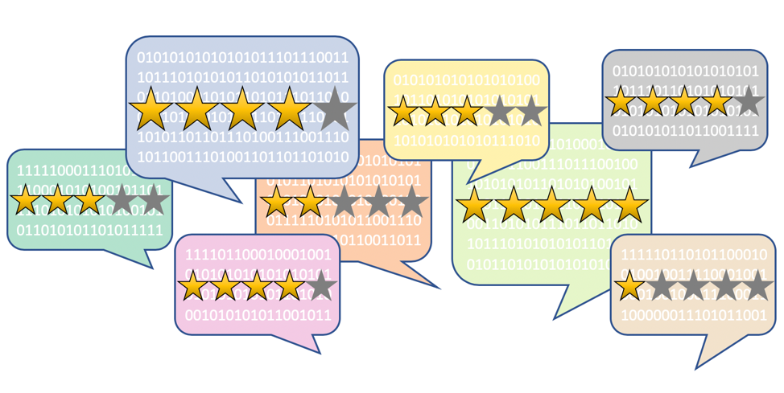

<!-- Find and Replace All [repo_name] -->
<!-- Replace [product-screenshot] [product-url] -->
<!-- Other Badgets https://naereen.github.io/badges/ -->
[![Contributors][contributors-shield]][contributors-url]
[![Forks][forks-shield]][forks-url]
[![Stargazers][stars-shield]][stars-url]
[![Issues][issues-shield]][issues-url]
[![LinkedIn][linkedin-shield]][linkedin-url]
<!-- [![License][license-shield]][license-url] -->

<!-- PROJECT LOGO -->
<br />
<p align="center">
  <a href="https://github.com/kevinclee26/sentiment_analysis_classification">
    
  </a>

  <h3 align="center">sentiment_analysis_classification</h3>

  <p align="center">
    A Comparison of Three Common Approaches for NLP
    <br />
    <a href="https://github.com/kevinclee26/sentiment_analysis_classification"><strong>Explore the docs »</strong></a>
    <br />
    <br />
    <a href="https://towardsdatascience.com/sentiment-analysis-comparing-3-common-approaches-naive-bayes-lstm-and-vader-ab561f834f89">View Demo</a>
    ·
    <a href="https://github.com/kevinclee26/sentiment_analysis_classification/issues">Report Bug</a>
    ·
    <a href="https://github.com/kevinclee26/sentiment_analysis_classification/issues">Request Feature</a>
  </p>
</p>

<!-- TABLE OF CONTENTS -->
<details open="open">
  <summary>Table of Contents</summary>
  <ol>
    <li>
      <a href="#about-the-project">About The Project</a>
      <ul>
        <li><a href="#built-with">Built With</a></li>
      </ul>
    </li>
    <li>
      <a href="#getting-started">Getting Started</a>
      <ul>
        <li><a href="#prerequisites">Prerequisites</a></li>
        <li><a href="#installation">Installation</a></li>
      </ul>
    </li>
    <li><a href="#usage">Usage</a></li>
    <li><a href="#roadmap">Roadmap</a></li>
    <li><a href="#contributing">Contributing</a></li>
	<!-- <li><a href="#license">License</a></li> -->
    <li><a href="#contact">Contact</a></li>
    <li><a href="#acknowledgements">Acknowledgements</a></li>
  </ol>
</details>

<!-- ABOUT THE PROJECT -->
## About The Project

[![Product Name Screen Shot][product-screenshot]][product-url]
This project is a detailed comparison between the common Sentiment Analysis approaches: Rule-Based VADER Sentimentl Analysis Tool, Naive Bayes Classifier, and Deep Learning LSTM. In separate notebooks, I provide the sample codes for running Sentiment Analysis using the [Sentiment140](https://www.kaggle.com/kazanova/sentiment140) data set. 

### Built With

<!-- This section should list any major frameworks that you built your project using. Leave any add-ons/plugins for the acknowledgements section. Here are a few examples. -->

* [Python](https://www.python.org/)
* [NLTK](https://www.nltk.org/)
* [VADER](https://github.com/cjhutto/vaderSentiment)
* [Keras](https://keras.io/about/)

<!-- GETTING STARTED -->
## Getting Started

<!-- This is an example of how you may give instructions on setting up your project locally. To get a local copy up and running follow these simple example steps. -->

The IPython notebooks have been provided. A supplementary article was written - check it out [here][product-url]. 

### Prerequisites

<!-- This is an example of how to list things you need to use the software and how to install them. -->
* Python
* Natural Language Toolkit
* TensorFlow
* Keras
* VADER Sentiment Analysis Tool
* scikit-learn

### Installation

1. Clone the repo
   ```sh
   git clone https://github.com/kevinclee26/sentiment_analysis_classification.git
   ```
2. Install pip - package installer for Python
   [here](https://pip.pypa.io/en/stable/installing/)
3. Install Python packages
   ```sh
   pip install vaderSentiment
   pip install nltk

   ```

<!-- USAGE EXAMPLES -->
## Usage

<!-- Use this space to show useful examples of how a project can be used. Additional screenshots, code examples and demos work well in this space. You may also link to more resources. -->
The project compares the use case and performance of 3 differnt Sentiment Analysis approaches. 

<!-- ROADMAP -->
## Roadmap

See the [open issues](https://github.com/kevinclee26/sentiment_analysis_classification/issues) for a list of proposed features (and known issues).

<!-- CONTRIBUTING -->
## Contributing

Contributions are what make the open source community such an amazing place to be learn, inspire, and create. Any contributions you make are **greatly appreciated**.

1. Fork the Project
2. Create your Feature Branch (`git checkout -b feature/AmazingFeature`)
3. Commit your Changes (`git commit -m 'Add some AmazingFeature'`)
4. Push to the Branch (`git push origin feature/AmazingFeature`)
5. Open a Pull Request

<!-- LICENSE -->
<!-- ## License

Distributed under the MIT License. See `LICENSE` for more information.
 -->

<!-- CONTACT -->
## Contact

Kevin Lee - [@kevin-c-lee26][linkedin-url] - kevin.c.lee26@gmail.com

Project Link: [https://github.com/kevinclee26/sentiment_analysis_classification](https://github.com/kevinclee26/sentiment_analysis_classification)

<!-- ACKNOWLEDGEMENTS -->
## Acknowledgements

* [Img Shields](https://shields.io)
* [Choose an Open Source License](https://choosealicense.com)
* [Kaggle](https://www.kaggle.com/kazanova/sentiment140)

<!-- MARKDOWN LINKS & IMAGES -->
<!-- https://www.markdownguide.org/basic-syntax/#reference-style-links -->
[contributors-shield]: https://img.shields.io/github/contributors/kevinclee26/sentiment_analysis_classification.svg?style=for-the-badge
[contributors-url]: https://github.com/kevinclee26/sentiment_analysis_classification/graphs/contributors
[forks-shield]: https://img.shields.io/github/forks/kevinclee26/sentiment_analysis_classification.svg?style=for-the-badge
[forks-url]: https://github.com/kevinclee26/sentiment_analysis_classification/network/members
[stars-shield]: https://img.shields.io/github/stars/kevinclee26/sentiment_analysis_classification.svg?style=for-the-badge
[stars-url]: https://github.com/kevinclee26/sentiment_analysis_classification/stargazers
[issues-shield]: https://img.shields.io/github/issues/kevinclee26/sentiment_analysis_classification.svg?style=for-the-badge
[issues-url]: https://github.com/kevinclee26/sentiment_analysis_classification/issues
<!-- [license-shield]: 
[license-url]:  -->
[linkedin-shield]: https://img.shields.io/badge/-LinkedIn-black.svg?style=for-the-badge&logo=linkedin&colorB=555
[linkedin-url]: https://www.linkedin.com/in/kevin-c-lee26/
[product-screenshot]: https://github.com/kevinclee26/sentiment_analysis_classification/blob/main/images/strengths_and_challenges.png?raw=true
[product-url]: https://towardsdatascience.com/sentiment-analysis-comparing-3-common-approaches-naive-bayes-lstm-and-vader-ab561f834f89